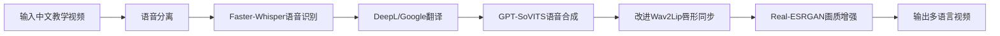
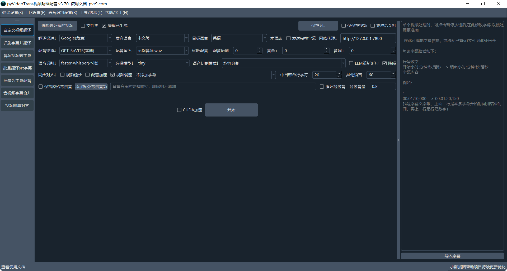
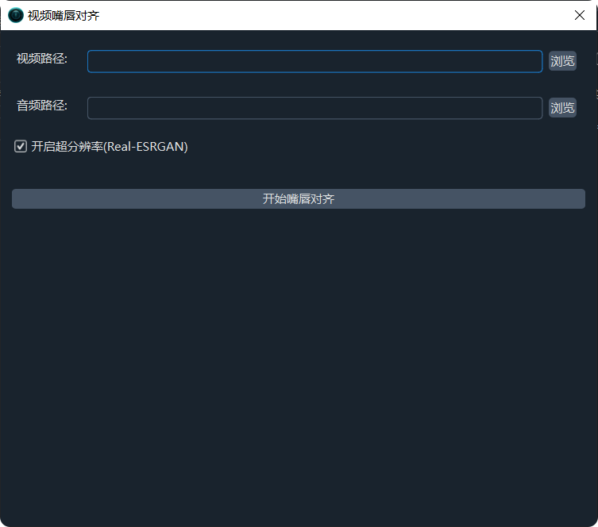
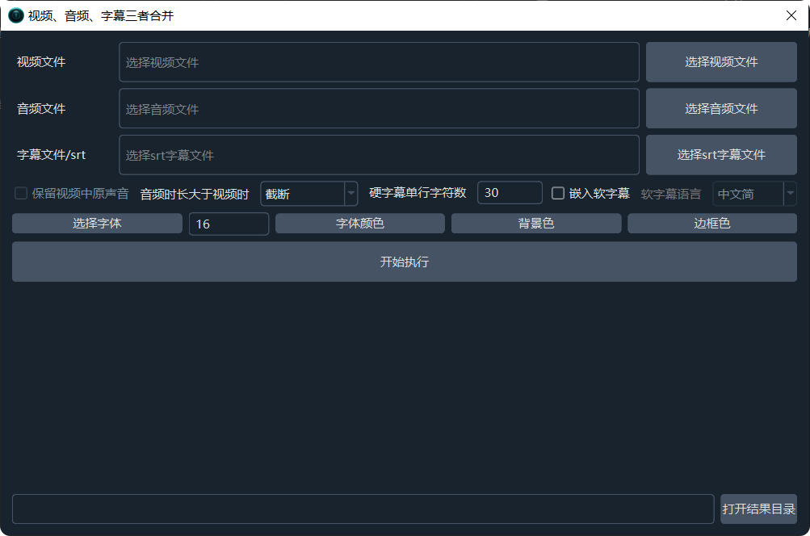

# 跨语言教学视频自动转换系统

## 1. 项目背景

**跨语言视频传播核心痛点**：
- 📌 传统人工翻译成本高、周期长
- 🎞️ 自动翻译工具存在音画不同步问题
- 🗣️ 语音克隆技术无法保留原说话人特征
- 📚 教育视频专业术语翻译准确率低

## 2. 解决方案
系统通过模块化流水线技术实现教学视频的自动化语言转换。针对教育视频跨国传播中的语言障碍问题，
系统采用Faster-Whisper模型进行高精度语音识别，通过机器翻译API完成文本转换，利用GPT-SoVITS技术实现音色保持的语音合成，
并创新性地结合改进的Wav2Lip算法实现唇形同步，最后通过Real-ESRGAN技术提升输出视频画质。
该系统有效解决了传统视频翻译中音画不同步、专业术语翻译不准确等问题，实现了从中文到多语言的高质量视频转换，为教育资源的全球化传播提供了完整的技术解决方案。


## 2.1 核心技术模块展示

<div style="display: grid; grid-template-columns: repeat(2, 1fr); gap: 25px; margin: 30px 0; align-items: start;">

### 语音识别模块
<div style="border: 1px solid #e1e4e8; border-radius: 8px; padding: 15px; box-shadow: 0 2px 5px rgba(0,0,0,0.1);">
  
  <p style="text-align: center; margin-top: 10px; font-size: 14px; color: #555;">
  </p>
</div>

### 文本翻译模块
<div style="border: 1px solid #e1e4e8; border-radius: 8px; padding: 15px; box-shadow: 0 2px 5px rgba(0,0,0,0.1);">
  
  <p style="text-align: center; margin-top: 10px; font-size: 14px; color: #555;">
  </p>
</div>

### 语音合成模块
<div style="border: 1px solid #e1e4e8; border-radius: 8px; padding: 15px; box-shadow: 0 2px 5px rgba(0,0,0,0.1);">
  
  <p style="text-align: center; margin-top: 10px; font-size: 14px; color: #555;">
  </p>
</div>

### 唇形同步模块
<div style="border: 1px solid #e1e4e8; border-radius: 8px; padding: 15px; box-shadow: 0 2px 5px rgba(0,0,0,0.1);">
  
  <p style="text-align: center; margin-top: 10px; font-size: 14px; color: #555;">
  </p>
</div>

### 画质增强模块
<div style="grid-column: span 2; max-width: 600px; margin: 0 auto; border: 1px solid #e1e4e8; border-radius: 8px; padding: 15px; box-shadow: 0 2px 5px rgba(0,0,0,0.1);">
  
  <p style="text-align: center; margin-top: 10px; font-size: 14px; color: #555;">
  </p>
</div>

</div>

## 2.2 核心技术模块代码

### 语音识别模块 (Faster-Whisper)
```python
import faster_whisper

def speech_to_text(audio_path: str, model_size: str = "large-v2"):
    """
    高精度语音识别
    :param audio_path: 输入音频路径
    :param model_size: 模型大小 (tiny|base|small|medium|large-v2)
    :return: 识别文本及时间戳
    """
    model = faster_whisper.WhisperModel(
        model_size,
        device="cuda",
        compute_type="float16"
    )
    segments, _ = model.transcribe(
        audio_path,
        beam_size=5,
        vad_filter=True,
        word_timestamps=True
    )
    return [(segment.text, segment.start, segment.end) for segment in segments]
```

### 语音合成模块 (GPT-SoVITS)
```python
from gpt_sovits import TTS

def text_to_speech(
    text: str,
    ref_audio: str,
    output_path: str,
    model_path: str = "pretrained/s2G488k.pth"
):
    """
    音色克隆语音合成
    :param text: 输入文本
    :param ref_audio: 参考音频路径（用于克隆音色）
    :param output_path: 输出音频路径
    :param model_path: 模型路径
    """
    tts = TTS(model_path)
    tts.generate(
        text=text,
        ref_audio=ref_audio,
        output_path=output_path,
        language="auto",
        speed=1.0
    )
```

### 唇形同步模块 (改进Wav2Lip)
```python
import torch
from wav2lip_improved import Wav2Lip

def lip_sync(
    video_path: str,
    audio_path: str,
    output_path: str,
    checkpoint: str = "checkpoints/wav2lip_gan.pth"
):
    """
    高精度唇形同步
    :param video_path: 输入视频（无声）
    :param audio_path: 输入音频
    :param output_path: 输出视频路径
    :param checkpoint: 模型检查点路径
    """
    device = "cuda" if torch.cuda.is_available() else "cpu"
    model = Wav2Lip(checkpoint=checkpoint).to(device)
    
    model.inference(
        video_path=video_path,
        audio_path=audio_path,
        output_path=output_path,
        face_det_batch_size=4,
        pads=[0, 10, 0, 0]  # 改进的唇部区域padding
    )
```

### 画质增强模块 (Real-ESRGAN)
```python
from basicsr.archs.rrdbnet_arch import RRDBNet
from realesrgan import RealESRGANer

def enhance_video(
    input_path: str,
    output_path: str,
    model_name: str = "RealESRGAN_x4plus"
):
    """
    视频超分辨率增强
    :param input_path: 输入视频路径
    :param output_path: 输出视频路径
    :param model_name: 模型名称
    """
    model = RRDBNet(
        num_in_ch=3,
        num_out_ch=3,
        num_feat=64,
        num_block=23,
        num_grow_ch=32
    )
    
    upsampler = RealESRGANer(
        scale=4,
        model_path=f"weights/{model_name}.pth",
        model=model,
        tile=400,
        tile_pad=10
    )
    
    upsampler.enhance(
        input_path,
        output_path,
        fps=30,
        outscale=4
    )
```
## 3. 使用方法

### 🚀 快速启动
```bash
# Windows (PowerShell)
.\scripts\run.ps1

# Linux/macOS
chmod +x ./scripts/run.sh
./scripts/run.sh
```

## 4. 运行截图
<div style="display: grid; grid-template-columns: repeat(2, 1fr); gap: 25px; margin: 30px 0; align-items: start;">

### 语音翻译和合成模块
<div style="border: 1px solid #e1e4e8; border-radius: 8px; padding: 15px; box-shadow: 0 2px 5px rgba(0,0,0,0.1);">
  
  <p style="text-align: center; margin-top: 10px; font-size: 14px; color: #555;">
  </p>
</div>

### 唇形对齐模块
<div style="border: 1px solid #e1e4e8; border-radius: 8px; padding: 15px; box-shadow: 0 2px 5px rgba(0,0,0,0.1);">
  
  <p style="text-align: center; margin-top: 10px; font-size: 14px; color: #555;">
  </p>
</div>

### 双语字幕与视频合并模块
<div style="border: 1px solid #e1e4e8; border-radius: 8px; padding: 15px; box-shadow: 0 2px 5px rgba(0,0,0,0.1);">
  
  <p style="text-align: center; margin-top: 10px; font-size: 14px; color: #555;">
  </p>
</div>

</div>
