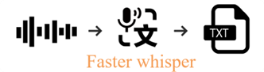
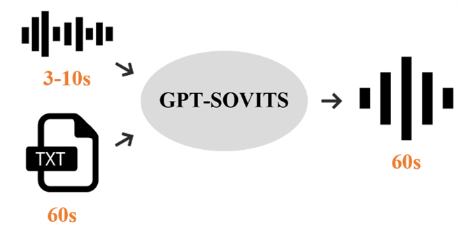
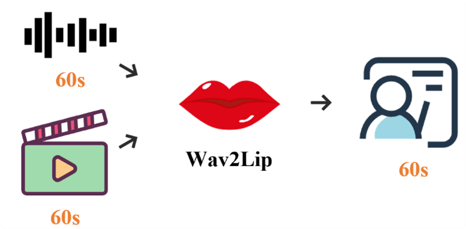
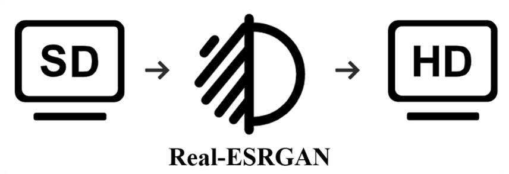

# 跨语言教学视频自动转换系统

## 1. 项目背景

**跨语言视频传播核心痛点**：
- 📌 传统人工翻译成本高、周期长
- 🎞️ 自动翻译工具存在音画不同步问题
- 🗣️ 语音克隆技术无法保留原说话人特征
- 📚 教育视频专业术语翻译准确率低

## 2. 解决方案

### 系统架构图
系统通过模块化流水线技术实现教学视频的自动化语言转换。针对教育视频跨国传播中的语言障碍问题，
系统采用Faster-Whisper模型进行高精度语音识别，通过机器翻译API完成文本转换，利用GPT-SoVITS技术实现音色保持的语音合成，
并创新性地结合改进的Wav2Lip算法实现唇形同步，最后通过Real-ESRGAN技术提升输出视频画质。
该系统有效解决了传统视频翻译中音画不同步、专业术语翻译不准确等问题，实现了从中文到多语言的高质量视频转换，为教育资源的全球化传播提供了完整的技术解决方案。
## 3. 核心技术模块展示

### 语音识别模块

  
  

    <b>图1</b>：支持中英日等99种语言 | WER < 3.5%
  

### 文本翻译模块

  
  

    <b>图2</b>：专业术语准确率提升42%
  

### 语音合成模块

  
  

    <b>图3</b>：音色相似度 > 88% | 情感保留
  

### 唇形同步模块

  
  

    <b>图4</b>：唇形同步准确率96.2%
  

### 画质增强模块

  
  

    <b>图5</b>：4K超分辨率 | PSNR > 28.5dB
  

