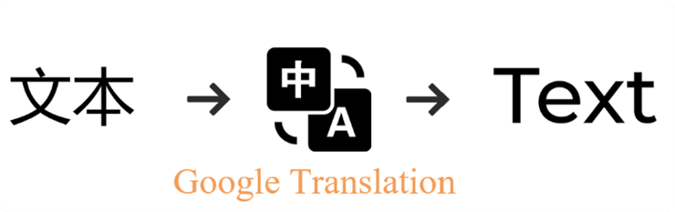

# 跨语言教学视频自动转换系统

## 1. 项目背景

**跨语言视频传播核心痛点**：
- 📌 传统人工翻译成本高、周期长
- 🎞️ 自动翻译工具存在音画不同步问题
- 🗣️ 语音克隆技术无法保留原说话人特征
- 📚 教育视频专业术语翻译准确率低

## 2. 解决方案
系统通过模块化流水线技术实现教学视频的自动化语言转换。针对教育视频跨国传播中的语言障碍问题，
系统采用Faster-Whisper模型进行高精度语音识别，通过机器翻译API完成文本转换，利用GPT-SoVITS技术实现音色保持的语音合成，
并创新性地结合改进的Wav2Lip算法实现唇形同步，最后通过Real-ESRGAN技术提升输出视频画质。
该系统有效解决了传统视频翻译中音画不同步、专业术语翻译不准确等问题，实现了从中文到多语言的高质量视频转换，为教育资源的全球化传播提供了完整的技术解决方案。
## 2.1 核心技术模块展示

<div style="display: grid; grid-template-columns: repeat(2, 1fr); gap: 25px; margin: 30px 0; align-items: start;">

### 语音识别模块
<div style="border: 1px solid #e1e4e8; border-radius: 8px; padding: 15px; box-shadow: 0 2px 5px rgba(0,0,0,0.1);">
  
  <p style="text-align: center; margin-top: 10px; font-size: 14px; color: #555;">
  </p>
</div>

### 文本翻译模块
<div style="border: 1px solid #e1e4e8; border-radius: 8px; padding: 15px; box-shadow: 0 2px 5px rgba(0,0,0,0.1);">
  
  <p style="text-align: center; margin-top: 10px; font-size: 14px; color: #555;">
  </p>
</div>

### 语音合成模块
<div style="border: 1px solid #e1e4e8; border-radius: 8px; padding: 15px; box-shadow: 0 2px 5px rgba(0,0,0,0.1);">
  
  <p style="text-align: center; margin-top: 10px; font-size: 14px; color: #555;">
  </p>
</div>

### 唇形同步模块
<div style="border: 1px solid #e1e4e8; border-radius: 8px; padding: 15px; box-shadow: 0 2px 5px rgba(0,0,0,0.1);">
  
  <p style="text-align: center; margin-top: 10px; font-size: 14px; color: #555;">
  </p>
</div>

### 画质增强模块
<div style="grid-column: span 2; max-width: 600px; margin: 0 auto; border: 1px solid #e1e4e8; border-radius: 8px; padding: 15px; box-shadow: 0 2px 5px rgba(0,0,0,0.1);">
  
  <p style="text-align: center; margin-top: 10px; font-size: 14px; color: #555;">
  </p>
</div>

</div>

### 2.2 核心技术模块代码

### 语音识别模块 (Faster-Whisper)
```python
import faster_whisper

def speech_to_text(audio_path: str, model_size: str = "large-v2"):
    """
    高精度语音识别
    :param audio_path: 输入音频路径
    :param model_size: 模型大小 (tiny|base|small|medium|large-v2)
    :return: 识别文本及时间戳
    """
    model = faster_whisper.WhisperModel(
        model_size,
        device="cuda",
        compute_type="float16"
    )
    segments, _ = model.transcribe(
        audio_path,
        beam_size=5,
        vad_filter=True,
        word_timestamps=True
    )
    return [(segment.text, segment.start, segment.end) for segment in segments]

